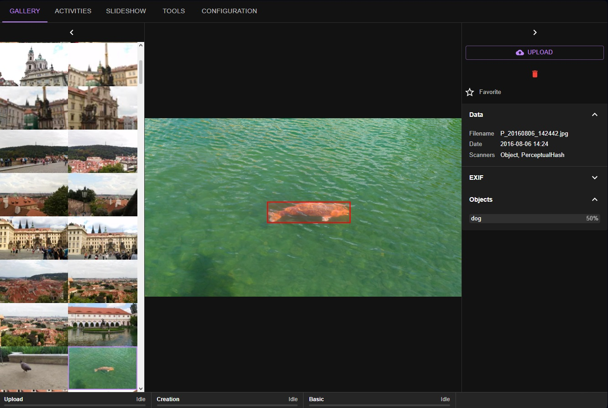
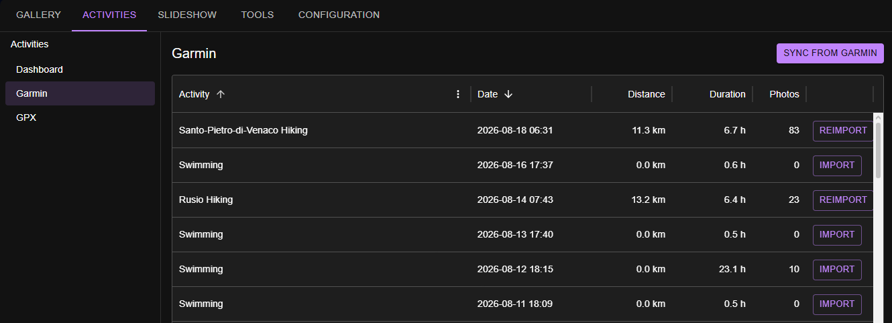
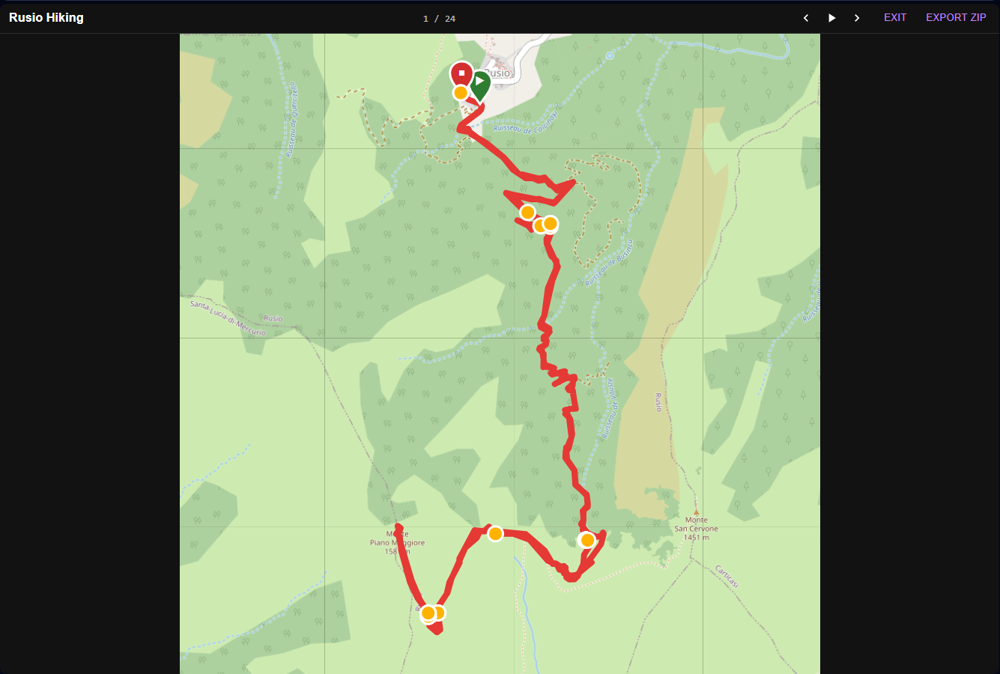
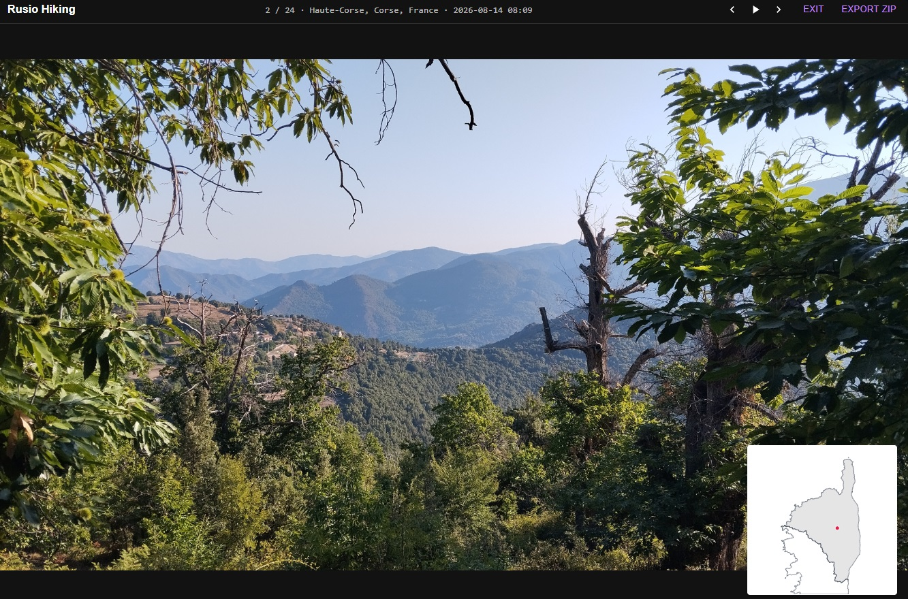
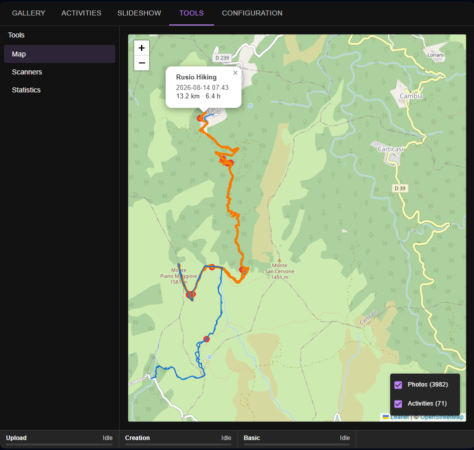

# Trailframe

[](https://github.com/sildra/trailframe/releases)
[](https://github.com/sildra/trailframe/commits/main)
[](LICENSE)


A self-hosted photo gallery for people who move: photos and GPS activities (Garmin Connect / GPX) live side by side, linked by time and place. One server hosts everything — a FastAPI backend that also serves its web UI.



## Photo library

- Automatic ingestion of a photo folder, with EXIF capture (camera, date, GPS) on import.
- Multi-size thumbnails generated and cached per photo; sizes are configurable.
- **Favorites** — mark photos you love and find them instantly; favorite-only views everywhere.
- **Automatic groups** — related photos are clustered so bursts and series stay together.
- Filter and combine by date range, group, location, tags, and favorites.

## Activities

- Import activities from Garmin Connect or GPX files.
- Every activity gets a trace map; photos taken during the activity appear alongside it.
- Interactive map with selectable traces and popups showing distance, duration, and time.



## Slideshows

- Slideshow sources: an activity (photos + trace), a group, or a fully custom selection.
- Custom slideshows support date ranges, groups, locations, tags, randomization, and favorites-only.
- **Thumbnail mode** renders slides from cached thumbnails instead of full images — smooth playback even for large libraries, with the size chosen automatically from the available screen space.
- Standalone kiosk entry (`/slideshow.html`) with deep-linkable URLs for dedicated screens.
- ZIP export of an activity's photos.




## Enrichment pipelines

Photos are processed by pluggable scanners:

| Scanner | What it does |
| --- | --- |
| File | Registers the file (name, size) |
| EXIF | Extracts camera metadata, dates, and GPS position |
| Thumbnail | Generates all configured thumbnail sizes |
| Activity | Links photos to imported activities |
| Brisque | Scores image quality |
| Location | Resolves GPS coordinates to places and countries |
| Object | Detects objects in photos (YOLO models, downloaded automatically) |
| PerceptualHash | Fingerprints images for duplicate/near-duplicate grouping |

Scanners can be force re-run individually from the Tools page — e.g. regenerate all thumbnails after changing their sizes.

## Maps

- Wireframe maps of your photo coverage and per-photo location maps.
- Built-in tile cache/proxy: tiles are fetched once from the configured provider and served locally afterwards.



## Statistics

- Per-scanner throughput (items processed and speed).
- Storage overview: database size plus disk usage of every data folder.

## Install

A wheel is attached to every [release](https://github.com/sildra/trailframe/releases/latest): download the latest `trailframe-…-py3-none-any.whl` and install it with pip (Python 3.12 or newer):

```bash
pip install trailframe-…-py3-none-any.whl
```

All Python dependencies are pulled in automatically; the web UI is bundled inside the wheel.

## Running

Run the `trailframe` command from the folder where all data (database, thumbnails, caches, trash) should live:

```bash
trailframe --config path/to/config.yaml
```

(`python -m trailframe.main` is equivalent.) The server listens on port 8000 by default; open `http://localhost:8000`. On first start a default `config.yaml` is written to the current directory.

### From source

Build the web UI once (`npm install && npm run build` inside `frontend/`), then start the server from the repository root:

```bash
python supervisor.py --config path/to/config.yaml
```

The supervisor restarts the server whenever it exits and forwards SIGTERM/SIGBREAK to it. To build a wheel yourself, build the web UI first, then run `pip wheel .`.
